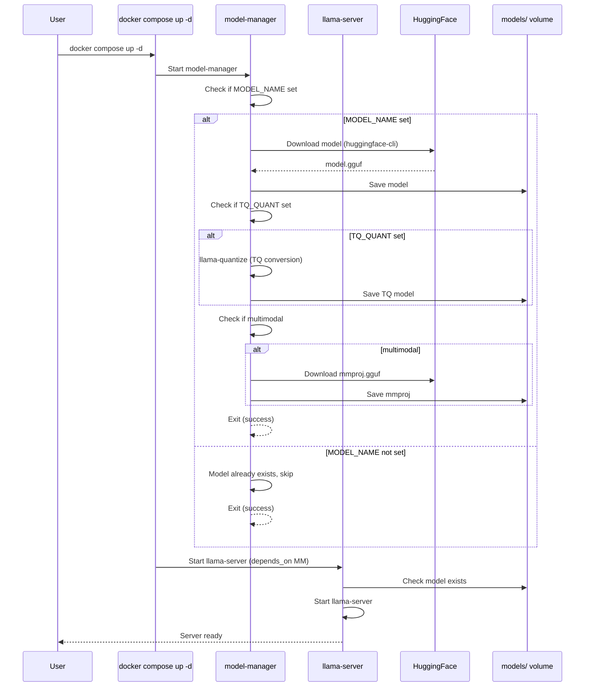
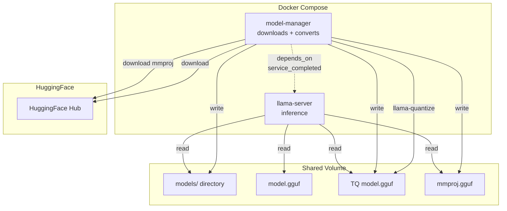

# Plan: Runtime-First Model Server

## Goal

Enable a single-command workflow: `docker compose up -d` to build and run a model server, with automatic model download from HuggingFace and quantization conversion.

## Current Codebase Analysis

### Used Parts (Keep)

| File | Purpose | Status |
|------|---------|--------|
| [`entrypoint.sh`](entrypoint.sh) | Runtime model path resolution, server startup with env vars | **KEEP** - works well |
| [`scripts/manage_models.py`](scripts/manage_models.py) | Model download, quantization, TurboQuant conversion | **KEEP** - core functionality |
| [`Dockerfile`](Dockerfile) | llama.cpp builder, CUDA support, BLAS acceleration | **MODIFY** - remove build-time model download |
| [`docker-compose.yml`](docker-compose.yml) | GPU service definition | **MODIFY** - add model-manager dependency |
| [`docker-compose.cpu.yml`](docker-compose.cpu.yml) | CPU-only service definition | **MODIFY** - add model-manager dependency |
| [`.env.example`](.env.example) | Configuration template | **MODIFY** - simplify |
| [`start-tq-server.bat`](start-tq-server.bat) | Windows launcher | **MODIFY** - simplify |
| [`README.md`](README.md) | Documentation | **MODIFY** - update workflow |

### Unused Parts (Remove)

| File | Reason |
|------|--------|
| [`Dockerfile.model-manager`](Dockerfile.model-manager) | Broken - references `builder` stage from main Dockerfile which doesn't exist in its build context. Model management should be a standalone service. |
| [`config/server-config.json`](config/server-config.json) | Never referenced by any code. All config is via environment variables in `entrypoint.sh`. |

### Issues Found

1. **`Dockerfile.model-manager`** - References `COPY --from=builder` but `builder` is a stage in the main `Dockerfile`, not accessible from this build context. The `llama-quantize` and `llama-convert-hf-to-gguf` binaries won't be available.
2. **Build-time model download** - Requires two steps (`docker compose build` then `docker compose up -d`), contradicts the one-command goal.
3. **`docker-compose.yml`** - Mounts `./models:/models:ro` but model-manager needs write access to download models.
4. **`docker-compose.cpu.yml`** - Same issue with read-only mount.
5. **`start-tq-server.bat`** - Complex logic for build-time model download that's being removed.

---

## New Architecture

```
┌─────────────────────────────────────────────────────────────────┐
│                    docker compose up -d                        │
└─────────────────────────────────────────────────────────────────┘
                              │
              ┌───────────────┼───────────────┐
              ▼               ▼               ▼
    ┌────────────────┐ ┌──────────────┐ ┌──────────────┐
    │  model-manager  │ │ llama-server │ │  (none)      │
    │  (downloads)    │ │ (inference)  │ │              │
    └────────────────┘ └──────────────┘ └──────────────┘
              │               │
              ▼               ▼
    ┌─────────────────────────────────┐
    │      models/ (shared volume)    │
    │  - model.gguf (downloaded)      │
    │  - model-quant.gguf (converted) │
    │  - mmproj.gguf (if multimodal)  │
    └─────────────────────────────────┘
```

### Service Dependency Pattern

```
model-manager (downloads model) → llama-server (waits for model) → ready
```

- `model-manager` runs once, downloads and converts the model, then exits.
- `llama-server` depends on `model-manager` and waits for the model file before starting.
- On subsequent runs, `model-manager` detects the model exists and exits immediately.

---

## Detailed Changes

### 1. Remove Unused Parts

#### Delete `Dockerfile.model-manager`
- Broken by design (references non-existent `builder` stage)
- Will be replaced by a simpler approach

#### Delete `config/server-config.json`
- Never referenced by any code
- All configuration is via environment variables

#### Delete `start-tq-server.bat`
- Complex build-time model download logic that's being removed
- Will be replaced with a simpler launcher

### 2. Redesign `Dockerfile` (llama-server only)

**Changes:**
- Remove build-time model download (the `RUN if [ -n "$MODEL_NAME" ]...` block)
- Remove `MODEL_NAME`, `MODEL_QUANT`, `TQ_QUANT` build args
- Remove `ARG` declarations for model configuration
- Keep: CUDA builder stage, BLAS acceleration, llama.cpp binaries, huggingface-cli
- Simplify: Remove `.model_path` file logic (runtime will handle this)
- Add: A wait script that checks for model file before starting llama-server

**New Dockerfile structure:**
```dockerfile
# Builder stage (unchanged)
FROM nvidia/cuda:12.4.1-devel-ubuntu22.04 AS builder
# ... build llama.cpp with CUDA + BLAS ...

# Runtime stage
FROM nvidia/cuda:12.4.1-runtime-ubuntu22.04
# ... copy binaries, install huggingface-cli ...

# No build-time model download
# No ARG MODEL_NAME, MODEL_QUANT, TQ_QUANT

# Wait script for model availability
COPY entrypoint.sh /entrypoint.sh

EXPOSE 8080
HEALTHCHECK ...
ENTRYPOINT ["/entrypoint.sh"]
CMD ["--host", "0.0.0.0", "--port", "8080"]
```

### 3. Redesign `Dockerfile.model-manager` (standalone)

**New approach:** A simple Python-based model manager that:
- Downloads models from HuggingFace using `huggingface_hub`
- Converts quantization using `llama-quantize` (needs to be installed)
- Handles TurboQuant conversion
- Handles mmproj download for multimodal models

**New Dockerfile:**
```dockerfile
FROM python:3.11-slim

# Install llama.cpp quantize tools
# Option A: Download pre-built llama-quantize binary
# Option B: Build from source (requires cmake, etc.)
# For simplicity, use Option A - download the binary

# Install huggingface_hub for model downloads
RUN pip install --no-cache-dir huggingface_hub

# Create models directory
RUN mkdir -p /models

# Copy model management script
COPY scripts/manage_models.py /scripts/manage_models.py

# Default entrypoint
ENTRYPOINT ["python", "/scripts/manage_models.py"]
```

**Key change:** `llama-quantize` needs to be available. Two options:
1. Download pre-built binary from llama.cpp releases
2. Build from source in the Dockerfile (adds complexity but ensures compatibility)

### 4. Update `docker-compose.yml` (GPU)

**Changes:**
- Add `model-manager` service with proper model download args
- Change `./models:/models` mount to read-write for llama-server
- Add `depends_on` for model-manager
- Add `condition: service_completed_successfully` so llama-server waits for model-manager
- Remove build-time model args (MODEL_NAME, MODEL_QUANT, TQ_QUANT)
- Add new env vars for model specification

**New structure:**
```yaml
services:
  model-manager:
    build:
      context: .
      dockerfile: Dockerfile.model-manager
    container_name: model-manager
    volumes:
      - ./models:/models
    environment:
      - HF_TOKEN=${HF_TOKEN:-}
      - MODEL_NAME=${MODEL_NAME:-}
      - MODEL_QUANT=${MODEL_QUANT:-}
      - TQ_QUANT=${TQ_QUANT:-}
      - MMPROJ=${MMPROJ:-}
    profiles:
      - download
    # No restart - runs once and exits

  llama-server:
    build:
      context: .
      dockerfile: Dockerfile
    container_name: llama-server
    ports:
      - "8080:8080"
    volumes:
      - ./models:/models:rw
      - ./config:/config:ro
    environment:
      - NVIDIA_VISIBLE_DEVICES=all
      - NVIDIA_DRIVER_CAPABILITIES=compute,utility
      - LLAMA_THREADS=${LLAMA_THREADS:-8}
      - LLAMA_CTX_SIZE=${LLAMA_CTX_SIZE:-4096}
      - LLAMA_GPU_LAYERS=${LLAMA_GPU_LAYERS:-99}
      - LLAMA_MAX_TOKENS=${LLAMA_MAX_TOKENS:-512}
      - LLAMA_TOP_P=${LLAMA_TOP_P:-0.95}
      - LLAMA_TEMP=${LLAMA_TEMP:-0.7}
      - LLAMA_MODEL=${LLAMA_MODEL:-}
      - LLAMA_MMPROJ=${LLAMA_MMPROJ:-}
      - LLAMA_IMAGE=${LLAMA_IMAGE:-}
    depends_on:
      model-manager:
        condition: service_completed_successfully
    restart: unless-stopped
    healthcheck:
      test: ["CMD", "curl", "-f", "http://localhost:8080/health"]
      interval: 30s
      timeout: 10s
      retries: 3
      start_period: 60s
```

### 5. Update `docker-compose.cpu.yml` (CPU)

**Changes:**
- Same pattern as GPU version
- Add `model-manager` service
- Change `./models:/models:ro` to `./models:/models:rw`
- Remove build-time model args

### 6. Update `entrypoint.sh`

**Changes:**
- Remove `.model_path` file logic (no longer needed - runtime model path is determined by env vars)
- Simplify model path resolution:
  1. `LLAMA_MODEL` env var (explicit)
  2. Default to `model.gguf` in `/models`
- Add wait logic: if model doesn't exist, wait for it (for model-manager dependency)

### 7. Update `scripts/manage_models.py`

**Changes:**
- Add `--model-name` and `--quant` args for the `download` command (already exists)
- Add `--tq-quant` arg for TurboQuant conversion
- Add `--mmproj` flag for multimodal models
- Add auto-detection: if model is multimodal, automatically download mmproj
- Add model existence check: if model already exists, skip download

### 8. Simplify `start-tq-server.bat`

**New approach:**
```batch
@echo off
REM Single-command model server launcher
REM Usage: start-tq-server.bat [MODEL_NAME] [QUANT] [TQ_QUANT] [gpu|cpu]

setlocal

set MODEL_NAME=%1
set MODEL_QUANT=%2
set TQ_QUANT=%3
set GPU_MODE=%4

if "%GPU_MODE%"=="" set GPU_MODE=gpu

REM Set compose file
if "%GPU_MODE%"=="cpu" (
    set COMPOSE_FILE=docker-compose.cpu.yml
) else (
    set COMPOSE_FILE=docker-compose.yml
)

REM Set model env vars
if not "%MODEL_NAME%"=="" (
    set MODEL_NAME=%MODEL_NAME%
    if "%MODEL_QUANT%"=="" set MODEL_QUANT=Q8_0
    if "%TQ_QUANT%"=="" set TQ_QUANT=TQ2_0
)

echo ========================================
echo  Model Server
echo ========================================
echo.
if not "%MODEL_NAME%"=="" (
    echo Model: %MODEL_NAME%
    echo Quant: %MODEL_QUANT%
    echo TurboQuant: %TQ_QUANT%
) else (
    echo Using existing model from ./models/
)
echo.

docker-compose -f %COMPOSE_FILE% up -d
```

### 9. Update `.env.example`

**Simplified:**
```env
# Server settings
LLAMA_HOST=0.0.0.0
LLAMA_PORT=8080

# Model path (optional - defaults to model.gguf in /models)
LLAMA_MODEL=

# Performance settings
LLAMA_THREADS=8
LLAMA_CTX_SIZE=4096
LLAMA_GPU_LAYERS=99
LLAMA_MAX_TOKENS=512

# Generation settings
LLAMA_TOP_P=0.95
LLAMA_TEMP=0.7

# Stop sequences (comma-separated)
LLAMA_STOP=

# HuggingFace token for gated models
HF_TOKEN=

# Model download (for one-command setup)
# MODEL_NAME=qwopus3.6-35b
# MODEL_QUANT=Q8_0
# TQ_QUANT=TQ2_0

# Multimodal settings
# LLAMA_MMPROJ=/models/mmproj.gguf
# LLAMA_IMAGE=/models/image.png
```

### 10. Update `README.md`

**Major changes:**
- Update Quick Start to single-command workflow
- Remove build-time model download instructions
- Update model download section to use `model-manager` service
- Update TurboQuant section to use runtime conversion
- Update architecture diagram
- Simplify configuration section

---

## New Workflow

### One-Command Setup (with model download)

```bash
# GPU with model download and TurboQuant conversion
MODEL_NAME=qwopus3.6-35b MODEL_QUANT=Q8_0 TQ_QUANT=TQ2_0 docker compose up -d

# CPU with model download
MODEL_NAME=llama3.1-8b MODEL_QUANT=Q4_K_M docker compose -f docker-compose.cpu.yml up -d

# Existing model (no download)
docker compose up -d
```

### Model Management

```bash
# List available models
docker compose --profile download run --rm model-manager list

# Download a model
docker compose --profile download run --rm model-manager download qwopus3.6-35b -q Q8_0

# Convert to TurboQuant
docker compose --profile download run --rm model-manager turboquant /models/Qwopus3.6-35B-A3B-v1-Q8_0.gguf -q TQ2_0

# List models in /models
docker compose --profile download run --rm model-manager list
```

---

## Mermaid Diagram: Service Flow



## Mermaid Diagram: Architecture


