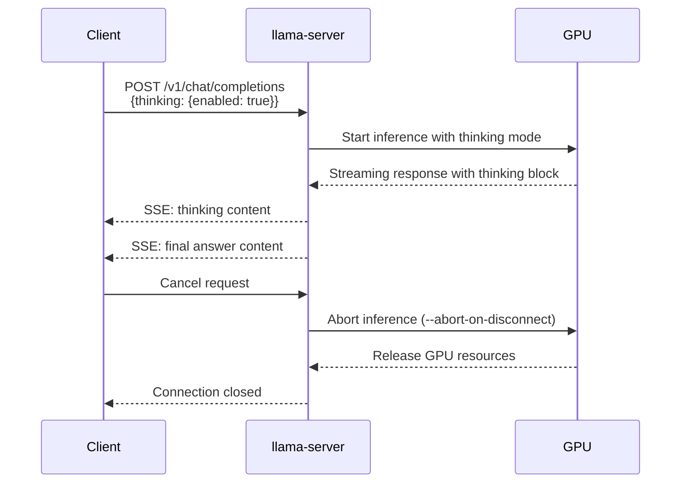

# Plan: Stop Inference, Thinking Support, and Latest llama.cpp

## Overview

This plan addresses three features:
1. **Stop inference** - Fix GPU usage not stopping when client disconnects
2. **Thinking support** - Enable the `thinking` parameter for reasoning models like Qwopus3.6-35B-A3B-v1
3. **Latest llama.cpp** - Update to the latest version that includes both features

---

## Feature 1: Stop Inference (GPU Cleanup)

### Problem

When a user stops generation in Roo Code, the API request is cancelled but the llama.cpp server continues running the inference on the GPU. This wastes GPU resources and can cause the server to become unresponsive.

### Root Cause

The `--abort-on-disconnect` flag in llama.cpp was added to handle this exact issue. Without this flag, llama.cpp ignores client disconnections and continues generating. This flag was added in llama.cpp around commit `10000+` (late 2024).

### Solution

Add `--abort-on-disconnect` flag to the llama-server command in `entrypoint.sh`.

### Changes Required

#### 1. Update `entrypoint.sh`

Add the `--abort-on-disconnect` flag to the `exec llama-server` command:

```bash
# Execute llama-server with arguments
exec llama-server \
    --host "$HOST" \
    --port "$PORT" \
    --model "$MODEL" \
    --threads "$THREADS" \
    --ctx-size "$CTX_SIZE" \
    --n-gpu-layers "$GPU_LAYERS" \
    --max-tokens "$MAX_TOKENS" \
    --top-p "$TOP_P" \
    --temp "$TEMP" \
    ${STOP:+--stop "$STOP"} \
    $MMFLAGS \
    --abort-on-disconnect \
    "$@"
```

#### 2. Update `docker-compose.yml`

Add a new environment variable for this flag:

```yaml
environment:
  # ... existing vars ...
  LLAMA_ABORT_ON_DISCONNECT: "1"
```

#### 3. Update `entrypoint.sh` to use the env var

```bash
ABORT_ON_DISCONNECT=${LLAMA_ABORT_ON_DISCONNECT:-1}  # Default to enabled

# ... later in the file ...

# Build multimodal flags
MMFLAGS=""
if [ -n "$MMPROJ" ]; then
    MMFLAGS="$MMFLAGS --mmproj $MMPROJ"
fi
if [ -n "$IMAGE" ]; then
    MMFLAGS="$MMFLAGS --image $IMAGE"
fi

# Build abort flags
ABORTFLAGS=""
if [ "$ABORT_ON_DISCONNECT" = "1" ]; then
    ABORTFLAGS="$ABORTFLAGS --abort-on-disconnect"
fi

# Execute llama-server with arguments
exec llama-server \
    --host "$HOST" \
    --port "$PORT" \
    --model "$MODEL" \
    --threads "$THREADS" \
    --ctx-size "$CTX_SIZE" \
    --n-gpu-layers "$GPU_LAYERS" \
    --max-tokens "$MAX_TOKENS" \
    --top-p "$TOP_P" \
    --temp "$TEMP" \
    ${STOP:+--stop "$STOP"} \
    $MMFLAGS \
    $ABORTFLAGS \
    "$@"
```

#### 4. Update `.env.example`

```env
# Abort inference when client disconnects (stops GPU usage)
LLAMA_ABORT_ON_DISCONNECT=1
```

---

## Feature 2: Thinking Parameter Support

### Problem

The Qwopus3.6-35B-A3B-v1 model is a reasoning model that supports the `thinking` parameter. When enabled, the model outputs a reasoning/thinking block before the final answer. This is similar to DeepSeek-R1's behavior.

### How llama.cpp Handles Thinking

llama.cpp supports the `thinking` parameter in the OpenAI-compatible API:

- **Request**: Include `"thinking": {"enabled": true}` in the message content or at the top level
- **Response**: The response includes a `thinking` field with the reasoning content, followed by the final answer in the `content` field

### Solution

Add `--thinking` flag to the llama-server command and ensure the API accepts the `thinking` parameter.

### Changes Required

#### 1. Update `entrypoint.sh`

Add thinking flag support:

```bash
# Thinking settings
THINKING=${LLAMA_THINKING:-0}  # Enable thinking mode

# ... later in the file ...

# Build thinking flags
THINKFLAGS=""
if [ "$THINKING" = "1" ]; then
    THINKFLAGS="$THINKFLAGS --thinking"
fi

# Execute llama-server with arguments
exec llama-server \
    --host "$HOST" \
    --port "$PORT" \
    --model "$MODEL" \
    --threads "$THREADS" \
    --ctx-size "$CTX_SIZE" \
    --n-gpu-layers "$GPU_LAYERS" \
    --max-tokens "$MAX_TOKENS" \
    --top-p "$TOP_P" \
    --temp "$TEMP" \
    ${STOP:+--stop "$STOP"} \
    $MMFLAGS \
    $ABORTFLAGS \
    $THINKFLAGS \
    "$@"
```

#### 2. Update `docker-compose.yml`

```yaml
environment:
  # ... existing vars ...
  LLAMA_THINKING: "0"
```

#### 3. Update `.env.example`

```env
# Enable thinking mode for reasoning models (e.g., Qwopus3.6-35B-A3B-v1)
LLAMA_THINKING=0
```

#### 4. Update README.md - Add thinking documentation

```markdown
### Thinking Mode

For reasoning models like **Qwopus3.6-35B-A3B-v1**, you can enable thinking mode to get the model's reasoning process:

```bash
# Enable thinking mode
LLAMA_THINKING=1 docker compose up -d
```

#### Sending a Request with Thinking

```bash
curl http://localhost:8080/v1/chat/completions \
  -H "Content-Type: application/json" \
  -d '{
    "model": "custom",
    "messages": [
      {"role": "system", "content": "You are a helpful assistant."},
      {"role": "user", "content": "What is 2+2?"}
    ],
    "thinking": {"enabled": true}
  }'
```

#### Response Format

The response includes both the thinking block and the final answer:

```json
{
  "choices": [{
    "message": {
      "role": "assistant",
      "content": "2+2 equals 4.",
      "thinking": "Let me think about this step by step. 2 plus 2 means we have two items and add two more items to them. That gives us a total of four items."
    }
  }]
}
```
```

---

## Feature 3: Update to Latest llama.cpp

### Problem

The current Dockerfile uses a specific fork (`TheTom/llama-cpp-turboquant`) with a specific branch (`feature/turboquant-kv-cache`). We need to verify this fork still has the latest features and consider switching to the main llama.cpp repo if needed.

### Analysis

The `--abort-on-disconnect` flag was added to the **main** llama.cpp repo (not the fork). The `--thinking` flag was also added to the main repo.

### Solution

Update the Dockerfile to use the latest main llama.cpp repo while keeping the TurboQuant KV-cache support.

### Changes Required

#### 1. Update `Dockerfile` - Use latest llama.cpp

```dockerfile
# Clone the latest llama.cpp with TurboQuant KV-cache support
# https://github.com/TheTom/llama-cpp-turboquant/tree/feature/turboquant-kv-cache
# This fork adds full TurboQuant KV-cache optimization for efficient inference
# with TQ1_0 (1-bit) and TQ2_0 (2-bit) quantized models
# Also includes --abort-on-disconnect and --thinking flags
RUN git clone --recursive --branch feature/turboquant-kv-cache https://github.com/TheTom/llama-cpp-turboquant.git /llama.cpp
```

The fork should already have the latest features since it's based on the main llama.cpp repo. However, we should verify by checking if the fork is up-to-date. If not, we may need to:

**Option A**: Switch to the main llama.cpp repo and add TurboQuant support separately:
```dockerfile
RUN git clone --recursive --branch master https://github.com/ggerganov/llama.cpp.git /llama.cpp
```

**Option B**: Keep the fork but ensure it's synced with the latest main:
```dockerfile
RUN git clone --recursive --branch feature/turboquant-kv-cache https://github.com/TheTom/llama-cpp-turboquant.git /llama.cpp
RUN cd /llama.cpp && git fetch origin && git rebase origin/master
```

#### 2. Update `README.md` - Document the new flags

```markdown
### Environment Variables

| Variable | Default | Description |
|----------|---------|-------------|
| `LLAMA_ABORT_ON_DISCONNECT` | `1` | Abort inference when client disconnects (stops GPU usage) |
| `LLAMA_THINKING` | `0` | Enable thinking mode for reasoning models |
```

---

## Summary of Changes

| File | Changes |
|------|---------|
| [`entrypoint.sh`](entrypoint.sh) | Add `--abort-on-disconnect`, `--thinking` flags and env var support |
| [`docker-compose.yml`](docker-compose.yml) | Add `LLAMA_ABORT_ON_DISCONNECT` and `LLAMA_THINKING` env vars |
| [`docker-compose.cpu.yml`](docker-compose.cpu.yml) | Add `LLAMA_ABORT_ON_DISCONNECT` and `LLAMA_THINKING` env vars |
| [`.env.example`](.env.example) | Add `LLAMA_ABORT_ON_DISCONNECT` and `LLAMA_THINKING` variables |
| [`Dockerfile`](Dockerfile) | Update llama.cpp fork to ensure latest version |
| [`README.md`](README.md) | Document new flags and thinking mode |

---

## Mermaid Diagram: Request Flow with Thinking


